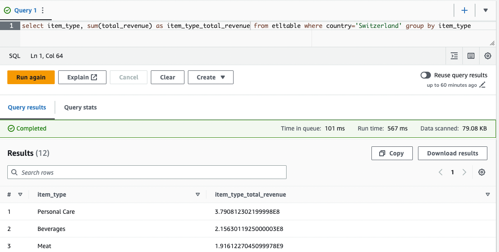

# Lambda ETL Pipeline


## Setup the Resources
### Setting up the artifacts
Ideally, we have a CI/CD pipeline to build this. For now we have to do it by hand.
1. Create `app.zip` that contains the `lambda_function.py` and `services` folder
2. Run `pip -r runtime_requirements.txt -t python` so the runtime required dependencies are placed in a folder called `python`. Note that this `runtime_requirements.txt` is the `requirements.txt` minus the dependencies already provided by AWS Lambda.
3. Create `requests-layer.zip` that contains just the `python` folder and its contents. 
4. For the artifacts, create a bucket named something unique and note that name down for the later CloudFormation step
5. upload the two zip file to that artifacts bucket name.

### CloudFormation
Apply CloudFormation template `template.yaml`. It will ask you where the bucket and files are that you created above. Note that you could have named the files as you wish. It will also ask where you want the actual data to live.

## Final Result
To run the application, run the `extract` Lambda function with this event:
```json
{
  "source_url": "https://eforexcel.com/wp/wp-content/uploads/2020/09/2m-Sales-Records.zip"
}
```
It will extract the zip file into the raw data folder specified in the CloudFormation run above, and it will also save the zip file in the backup folder specified also in the CloudFormation step above.

Then the S3 bucket where the raw data folder lives will kick off the `transformLoad` Lambda function. It will create/overwrite a database table in Glue named the way you indicated in the CloudFormation step above.

With Athena you can do a simple query and you can see the below:



